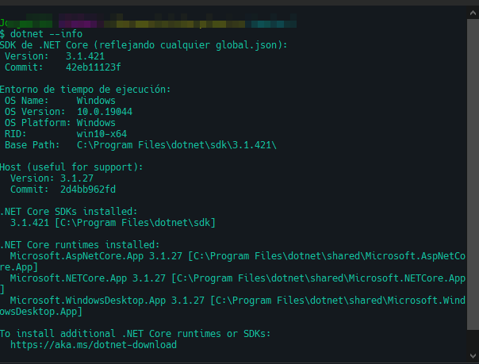

# Instalación y primer proyecto
Comenzaré con la instalación del SDK para netcore3.1 (aunque es practicamente lo mismo para el resto de versiones). El motivo de usar netcore y no .net framework, es la compatibilidad entre sistemas, permitiendonos poder crear aplicaciones tanto en windows como en linux o mac sin tener que hacer enormes cambios a nuestro codigo

## Windows

Lo primero a hacer será descargar un editor de código, podria ser el mismo Visual Studio 2019 ó 2022, pero en mi caso elegiré utilizar VSCode. El cual se descargará desde la pagina del mismo [VSCode](https://code.visualstudio.com/)

En el caso de Windows, la instalación es simplemente descargar desde la página de [Microsoft](https://dotnet.microsoft.com/en-us/download/dotnet/3.1) el ejecutable y simplemente dar siguiente y siguiente.. 

### Chocolatey

En el caso de querer instalarlo desde la consola, podemos emplear el gestor de paquetes `chocolatey`

```powershell
choco install dotnet-sdk
```
Una vez instalado, debemos reiniciar la consola, y luego ya podremos ver la instalación:
```powershell
dotnet --info
```


## Linux

Para poder instalarlo en linux, tendremos que tirar de _wget_ para poder clonar el _.deb_ a nuestra máquina, en este caso sobre Ubuntu 18.04

```bash
wget https://packages.microsoft.com/config/ubuntu/18.04/packages-microsoft-prod.deb -O packages-microsoft-prod.deb

sudo dpkg -i packages-microsoft-prod.deb
```

### Arch
En el caso de arch-linux, podemos usar el AUR
```bash
# Creamos un dir y nos colcamos sobre el
mkdir repos && cd repos

# Clonamos el repo
git clone https://aur.archlinux.org/dotnet-core-bin.git

# Saltamos al repo
cd dotnet-core-bin

# Usamos el makepkg
makepkg -si
```

Luego de ello tendremos que agregar a las variables de entorno:
```bash
export DOTNET_CLI_TELEMETRY_OPTOUT=1
```

finalmente podremos ver la version que hemos instalado

```bash
dotnet --info
```

## Primer proyecto
Crearemos primero que nada un proyecto de consola, para ello, lo que tenemos que hacer es crear la carpeta donde queremos crear el nuevo proyecto y mediante la linea de comando tipear:
```powershell
dotnet new console
```
Con la opcion --name podriamos ingresar el nombre de nuestro proyecto

```powershell
dotnet new console --name "HelloWord"
```

y por defecto nos creará una carpeta con el nombre que le hemos asignado, en caso de no asignarle ningun nombre, nos creará un proyecto con el nombre de la carpeta sobre la que estamos posicionados. Seguido a ello también creará algunos archivos:

- HelloWorld.csproj
- Program.cs
- Carpetas:
  - obj

Si abrimos el archivo HelloWorld.csproj nos encontraremos con lo siguiente:
```xml
<Project Sdk="Microsoft.NET.Sdk">

  <PropertyGroup>
    <OutputType>Exe</OutputType>
    <TargetFramework>netcoreapp3.1</TargetFramework>
  </PropertyGroup>

</Project>
```

y en Program.cs lo siguiente:
```csharp
using System;

namespace basic_00
{
    class Program
    {
        static void Main(string[] args)
        {
            Console.WriteLine("Hello World!");
        }
    }
}
```

Si ejecutamos el comando `dotnet run` sucederán dos cosas, por un lado compilará y creara una nueva carpeta llamada __bin__ y por otro lado ejecutará el programa mostrandonos por consola el mensaje "Hello World!"